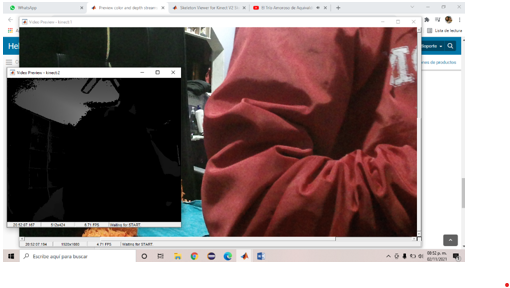

# BodyScan
Es un software para el analisis de marcha humana, con el cual especialistas en rehabilitación o creación de protesis. Ya que puede obtener datos adecuados para este tipo de cosas.

# Prerequisitos
Para poder ocupar de manera adecuada el software es necesario tener instalado:

MATLAB 2019 a posterior

Image Acquisition Toolbox

Microsoft Kinect for Windows Support from Image Acquisition Toolbox

Drivers necesarios para Kinect

Instalación completa de drivers
[Kinect for Windows SDK](https://www.microsoft.com/en-us/download/details.aspx?id=44561)

Instalación de drivers por separado
[Kinect for Windows Runtime 2.0](https://www.microsoft.com/en-us/download/confirmation.aspx?id=44559)

[Kinect Configuration Verifier](https://go.microsoft.com/fwlink/p/?LinkID=513889)

# Diagrama de conexión
Para conectar el Kinect a nuestro PC, basta con mirar el siguiente diagrama


# Prueba de funcionamiento

1 Conectar Kinect al PC

2 Abrir Matlab

3 Escribir el siguiente codigo en el command window
```Matlab
%Configuración y muestra de video camara de color
color = videoinput('kinect',1);
dataColor = getselectedsource(color);
preview(color);
pause(10);
closepreview(color);

%Configuración y muestra de video comara profundidad
dept = videoinput('kinect',2);
triggerconfig(depth,'manual');
depth.FramesPerTrigger = 1;
depth.TriggerRepeat = inf;
dataDetph = getselectedsource(depth);
preview(depth);
pause(10);
closepreview(depth);
```

4 Si todo funciona bien se mostraran dos ventanas con las camaras funcionando



> Nota: es caso de que algo funcione mal, checar la conexión y el codigo

# Instrucciones de uso
El proyecto consta de una aplicación grafica la cual monitorea los puntos obtenidos por parte de Kinect, esta se encuentra en la carpeta App. La ventana principal cuenta con cuatro partes:

- Muestra de video (camara de profundidad)
- Muestra de esqueleto (grafica de puntos)
- Panel de configuración
	- Switch de encendido/apagado
	- Perillas de configuración de color
	- Area de texto para mensajes
- Sistema de tabs
	- Datos sobre marcha humana
	- Monitoreo de puntos izquierda/derecha de articulaciones
	- Angulos de articulaciones principales

Para utilizarlo es necesario:

1 Abrir Matlab

2 Colocar en el command windows
```
appdesigner
```

3 Abrir el archivo GUIBiomecanica

4 Una vez abierto y cargado, dar clic en el icono Run (Triangulo verde)

5 Switch en on
