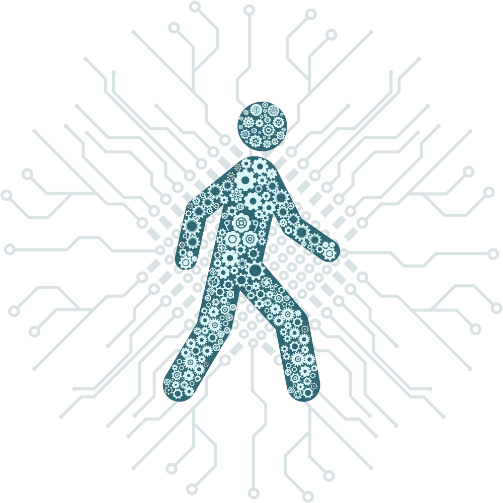
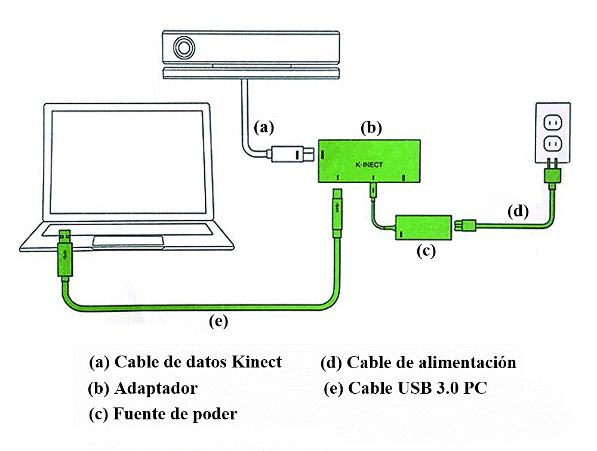
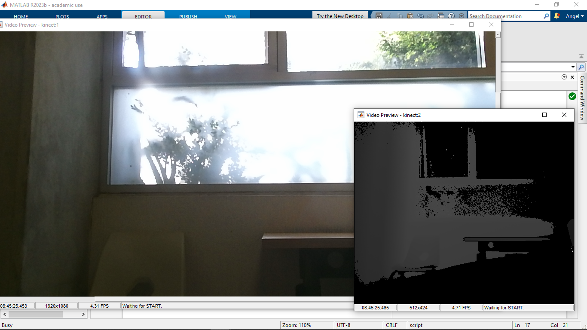
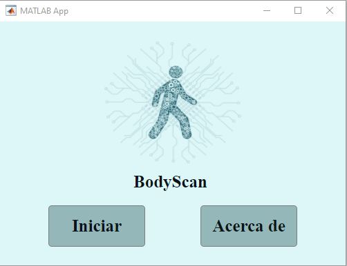
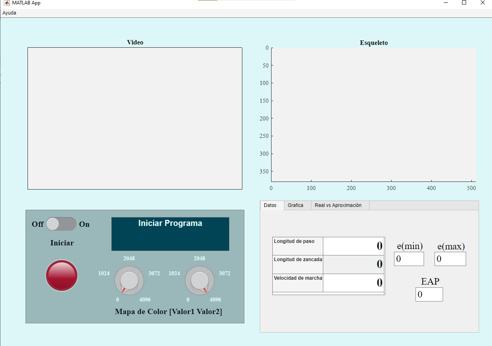

# BodyScan
BodyScan es un software de analisis de movimiento, el cual se especializa en la marcha humana. Este adquirie 25 puntos que corresponden a las articulaciones del cuerpo humano, obtenidos con ayuda de un Microsoft Kinect de la consola Xbox One.

Este proyecto se realizo como trabajo recepcional para titulación en la Universidad Autonoma de México. Este repositorio cuenta con los archivos necesarios para su funcionamiento, asi como la teoria y pendices necesarios, con los cuales se puede realizar actualizaciones al proyecto de manera libre, respetando al autor e incluyendo los cambios en un pull request. 

A continución se proporciona la documentación asociada al proyecto:

- [Analisis de requisitos](documents/ApendiceA.pdf)
- [Diseño de Software](documents/ApendiceB.pdf)
- [Diseño de UI (basico)](http://tinyurl.com/2dx6hujr)
- [Videos de la evolución del proyecto](https://youtube.com/playlist?list=PLTw9BBx8QZ8eyed2LNUoxuHmq4bUNzzX9&si=s9hxFf0v7OTLN5Tj)
- [Configuración general](documents/ApendiceC.pdf)
- [Manual de usuario](documents/ApendiceD.pdf)
- [Investigación](documents/investigacion.pdf)



# Prerequisitos
Para poder ocupar de manera adecuada el software es necesario tener instalado:

MATLAB 2019 a posterior

Image Acquisition Toolbox

Microsoft Kinect for Windows Support from Image Acquisition Toolbox

Drivers necesarios para Kinect

Instalación completa de drivers
[Kinect for Windows SDK](https://www.microsoft.com/en-us/download/details.aspx?id=44561)

Instalación de drivers por separado
[Kinect for Windows Runtime 2.0](https://www.microsoft.com/en-us/download/confirmation.aspx?id=44559)

[Kinect Configuration Verifier](https://go.microsoft.com/fwlink/p/?LinkID=513889)

# Diagrama de conexión
Para conectar el Kinect a nuestro PC, basta con mirar el siguiente diagrama



# Prueba de funcionamiento

1 Conectar Kinect al PC

2 Abrir Matlab

3 Escribir el siguiente codigo en el command window
```matlab
%Configuración y muestra de video camara de color
color = videoinput('kinect',1);
dataColor = getselectedsource(color);
preview(color);
pause(10);
closepreview(color);

%Configuración y muestra de video comara profundidad
dept = videoinput('kinect',2);
triggerconfig(depth,'manual');
depth.FramesPerTrigger = 1;
depth.TriggerRepeat = inf;
dataDetph = getselectedsource(depth);
preview(depth);
pause(10);
closepreview(depth);
```

4 Si todo funciona bien se mostraran dos ventanas con las camaras funcionando



> Nota: es caso de que algo funcione mal, checar la conexión y el codigo

# Instrucciones de uso
Existen dos maneras de utilizar el programa, Modificar programa y Instalación en ordenador personal; para ambas opciones es importante contar con los prerequisitos.

## Modificar programa

1 Clonar el repositorio en la ruta deseada

```
git clone https://github.com/AngelCruzO/KinectMatlab.git
```

1 Abrir Matlab

2 Colocar en el command window
```matlab 
appdesigner
```

3 Abrir el archivo GUIBiomecanica desde la ruta donde se clono el repositorio

4 Se puede modificar tanto la vista grafica como la parte de codigó

> Se deja a consideración realizar pull request, para incluir modificaciones. En caso de contribuciones, favor de seguir las instrucciones para pull request.

## Instalación en ordenador personal

1 Ir a la sección de releases

2 Descargar el ejecutable BodyScan.exe de la ultima versión (v1.9-alpha)

3 Abrir la carpeta de descargas, dar doble clic en el ejecutable

4 Seguir las instrucciones del instalador

> Es recomendable marcar la opción para crear un acceso directo en el escritorio

5 Si se creo el acceso directo, dar doble clic en el. En caso de no crearlo, buscar el programa de nombre BodyScan en el menu inicio

6 Se mostrara la siguiente ventana, clic en iniciar

7 Despues de unos segundo se mostrara la siguiente ventana



8 Para iniciar la adquisión, cambiar a "on" el switch, se empezaran a mostrar todos los datos en la interfaz



9 Para terminar el proceso, solo es cuestión de cambiar el switch a "off"
